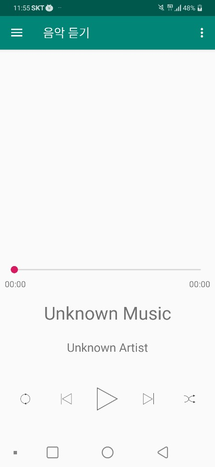
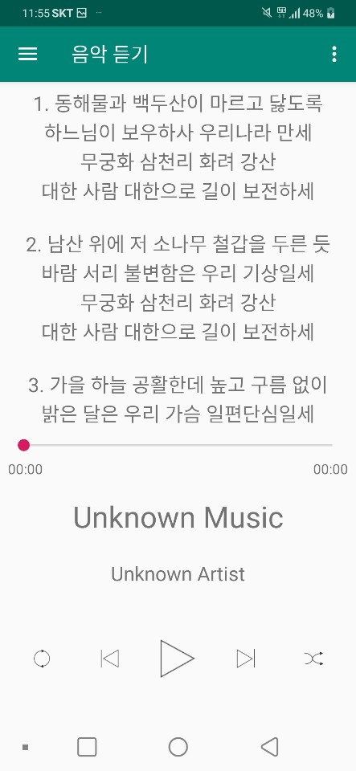
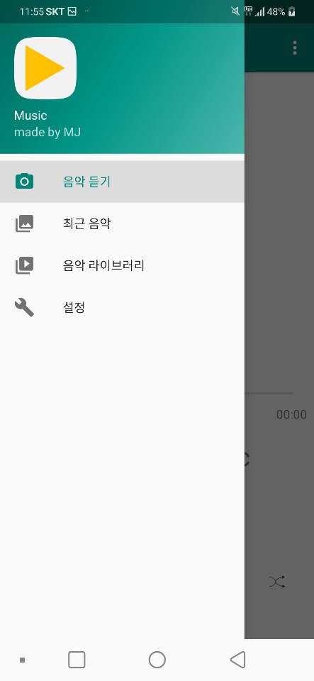

# hw_3 - MP3 Player    

## 테스트 환경  
유형 : Pixel 2 API 24  
목표 : 5.1  
PC OS 테스트 : Windows10 x64  
테스트 PC 프로세서 : Intel i5-8265U  
PC RAM 테스트 : 8GB  
사용 된 메모리 : 1232Mb 미만  
사용 된 CPU : 15 % 미만

## 개발
개발 언어 : JAVA

# UI 구현
## 음악듣기 

## 음악듣기 - 가사 화면
  
## 네비게이션  화면
  
## 최근 음악 화면
  
## 음악 라이브러리 화면
  
## 설정 화면
   

# 코드 구현
## 차후 수정